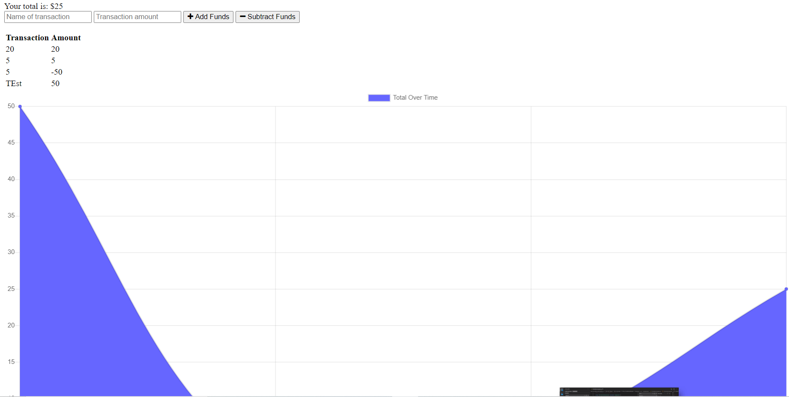

# __*Progressive Budget*__

## __License__
MIT

## __Description__
This app was created for anyone to actively track their spending and deposits. 
Deployed Heroku can be found at https://buildandflex.herokuapp.com/

## __Created By__
* [Allison Barnard](https://github.com/allisonbarnard07)

### __Installation__
Installation:  Node.js, MongoDB

### __Image__
Appe:

### __Contributing__
Pull requests are welcome.

### __Tests__
There are currently no tests.
